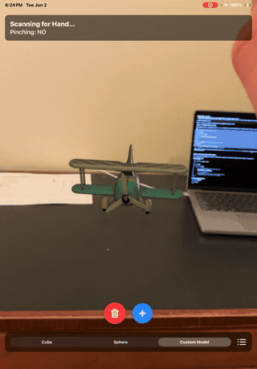

# Augmented Reality Test

This is an iOS Augmented Reality application built using SwiftUI, ARKit, RealityKit, and the Vision framework.

## Features

- **Plane Detection & Physics**: Maps real-world horizontal surfaces (like floors and tables) to invisible collision planes, allowing virtual objects to interact with and rest on the physical environment.
- **Hand Tracking**: Uses the Vision framework (`VNDetectHumanHandPoseRequest`) to track the user's hand movements in real-time through the device's camera.
- **Pinch-to-Grab Interaction**: Users can pinch their thumb and index finger together to grab placed AR objects.
  - While grabbed, the object's physics are suspended (kinematic mode), allowing you to move it freely through the air.
  - When released, the object's physics are re-enabled (dynamic mode), and it falls naturally back to the real-world surfaces.
- **Model Spawning**: Place standard 3D primitives (Cubes, Spheres, Cylinders) or a custom `.usdz` model into your physical space using the on-screen UI.

## How to Use

1. **Open the Project**: Open `augmented reality test.xcodeproj` in Xcode.
2. **Select Destination**: Connect your physical iOS device to your Mac and select it as the run destination at the top of the Xcode window.
3. **Run**: Click the Play button (`Cmd + R`) to build and run the app on your device.
4. **Permissions**: When prompted, grant the app permission to use the Camera.
5. **Scan Environment**: Point your camera at a textured horizontal surface (like a desk or floor) and move the device slightly to let ARKit detect the plane. The AR Coaching Overlay will guide you.
6. **Place Objects**: 
   - Select a model type from the segmented picker at the bottom.
   - Tap the blue `+` button or tap anywhere on the screen to drop the object into the AR world.
7. **Interact**: 
   - Hold your hand in front of the camera until the HUD indicates "Hand Detected".
   - Hover your hand near a spawned object and pinch your thumb and index finger together to grab it.
   - Move your hand to drag the object.
   - Un-pinch to drop it and watch it fall!

## Project Structure

- `ContentView.swift`: Contains the main SwiftUI views, the ARViewModel, and the `CustomARView` which handles the core ARKit session, Vision hand tracking, raycasting, and physics interactions.
- `toy_biplane_realistic.usdz`: A custom 3D model asset that can be placed in the scene.
